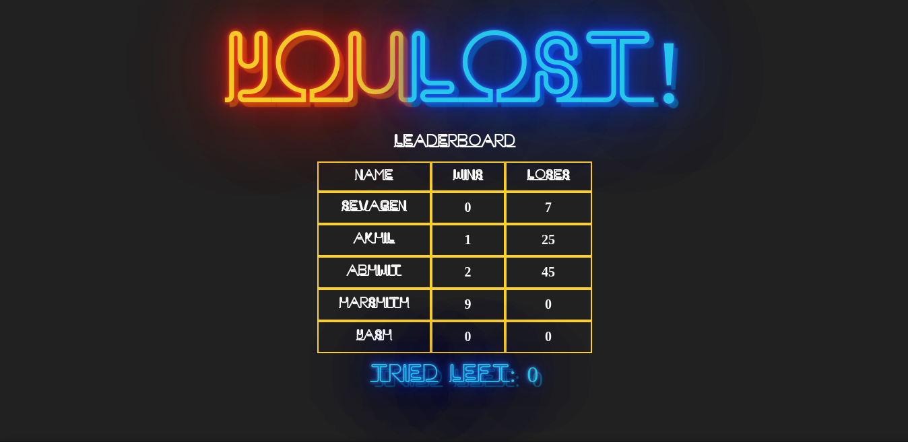

<h1>Lights Out :fire:</h1>

This challenge is about verifying whether you've got a good hang of basic React concepts as well as Django and GraphQL in overall

<h2>Stages :bar_chart:</h2>

This challenge consists of 3 stages

<ul>
<li>First Stage - Get the LightsOut Game working - use the lights-out folder only</li>
<li>Second Stage - Render a leaderboard in lights-out but fetch the data from backend in django folder. Use GraphQL for querying</li>
<li>Third Stage - Instead of querying, now I want a mutation to happen. Have some very simple form for the user to enter his name. Then use GraphQL to send a POST request to db to add new entry and render the leaderboard with new entry</li>
</ul>

 
<h2>The Game - First Stage :video_game:</h2>

Lights Out is a logic game played on a grid of individual lights, which can either be lit or unlit. The puzzle is won when all the lights are turned off.

You can click on each individual cell to toggle that light - but its also toggles the light above it, left of it, right and below of it.

<h2>Code :octocat:</h2>

This game will be built from 5 components

<h2>Component Design</h2>
<h3>App</h3>

As often, this is a very simple component. It just renders the Board component

<h3>Board</h3>

The parent component, in this case Board, will hold the state that represents the in-memory grid of true
/false for lights on/off. Since the state for the board lives in here, this is also where <strong>setState() </strong>
calls will need to go - and there all functions that call <strong>setState()</strong>

<h3>Cell</h3>

A simple component. This will simple render a <strong>div</strong> where the CSS classes will indicate whether this cell is lit or unlit. This is what the user clicks on -- but it will need to call a function its receives from <strong>Board</strong> since that will need to update the state.

<h3>Leaderboard</h3>

As the name suggest, this component will render the data that is fetch from the django side of the challenge through a GraphQL query.

<h3>Form</h3>

This simple form will take in the user's name and push it to the django db through a GraphQL mutation, then re-rendering the whole app.

<h1>Overview :chart_with_upwards_trend:</h1>

The game should be able to satisfy the following functions

The overall board should look like the following image. Don't worry about the styles, it's not required for you to replicate what I did but the same functionality should be there. You'll need to guess where to add the classNames

</img>

Please find the "LightsOutTryout.mp4" video in the public directory to refer the basic functionality of the app. I gave a default number of moves of 20 ( this can be changed if you want) and everytime the user tries/clicks a cell, the number of tries decreases my 1. When it reaches 0, the game is over :)

When the user wins, the board component should be replaced with the following layout. The choice of making it a component or not is yours.

</img>

<h2>Django - Second Stage :snake:</h2>

Use the provided django starter code in the django folder to set up your project and GraphQL

I've left some comments/notes in certain files to help you but in the end, the following functions should be there in your PR

<ul>
<li>Data in lights-out/src/Leaderboard.jsx should be fetch from django server aka http://localhost:8000/graphql/</li>
<li>Model should conists of 3 fields (name, wins, loses) where wins and loses are integers initialized as 0</li>
<li>localhost:8000/graphql/ should be working and you should be able to test your queries
</ul>

In the end, after fetching the data, leaderboard should be displayed when you win or lose, basically at the end of the game

</img>

<h2>Third and Final Stage :pushpin: </h2>

Hopefully, you guys would be done with the regular fetching to this point. Now, the goal is to create a new record to the database which, if you remember correctly, is done through <strong>Mutation</strong> in GraphQL. So basically, you'll have a Form component (basic boilerplate provided) which will make a mutation upon submitting/request. Then the change should be visible in the leaderboard

The image below gives an idea of what is to be done. Once the game is over, you'll be given the option to enter your name

</img>

After submitting your name, the leaderboard should have the new entry on re-rendering

</img>

<h2>How to submit the solution ?</h2>

Make a PR with with each commit properly labelled for each stage (First stage, Second stage, etc...) of the challenge.

<strong>Note: Don't squash everything into one commit please :)</strong

